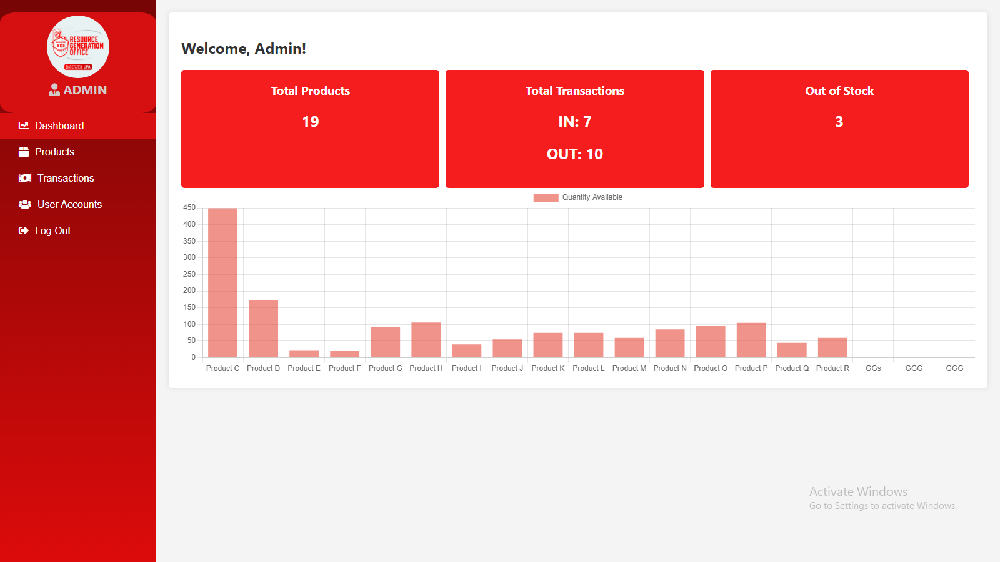
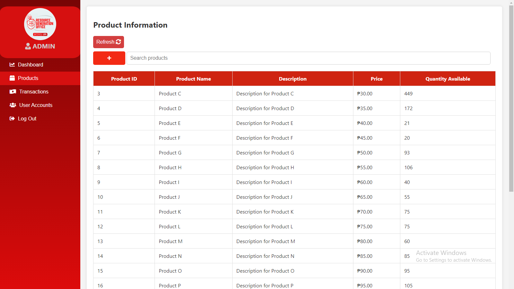
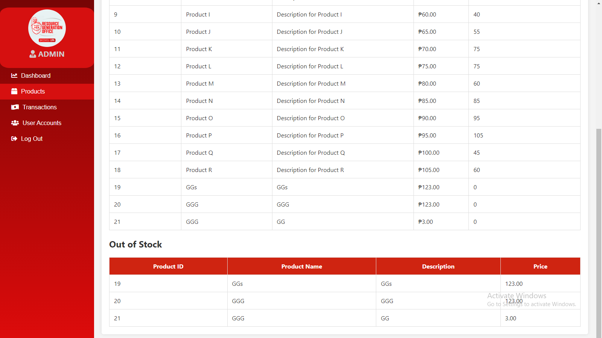
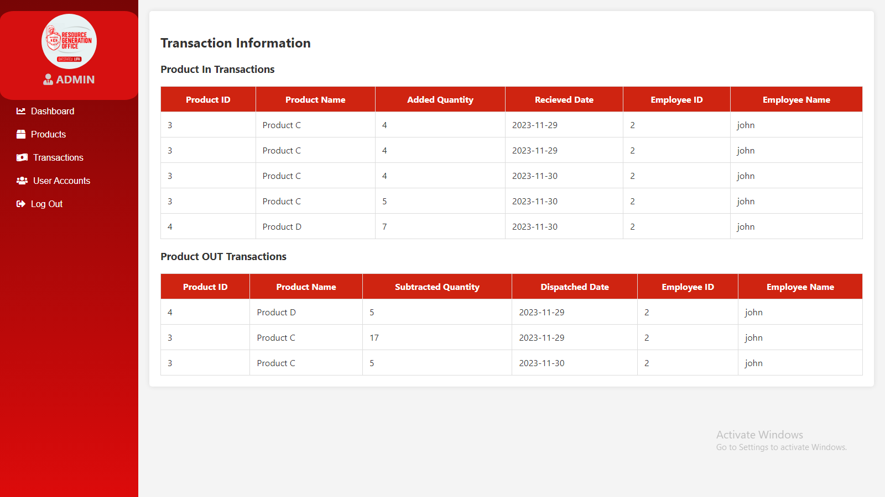
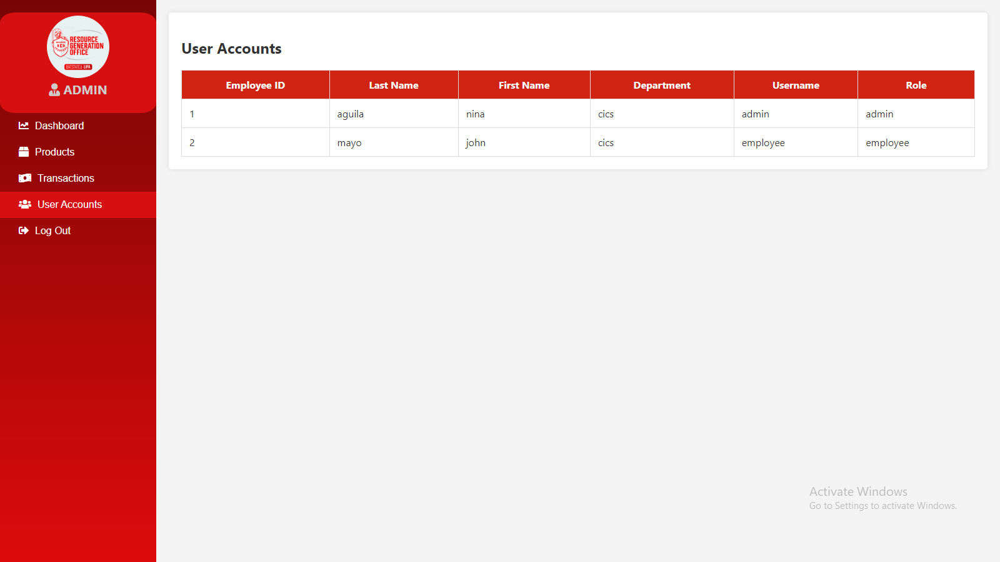
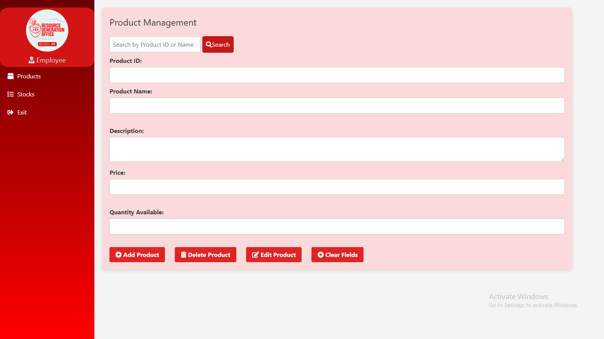
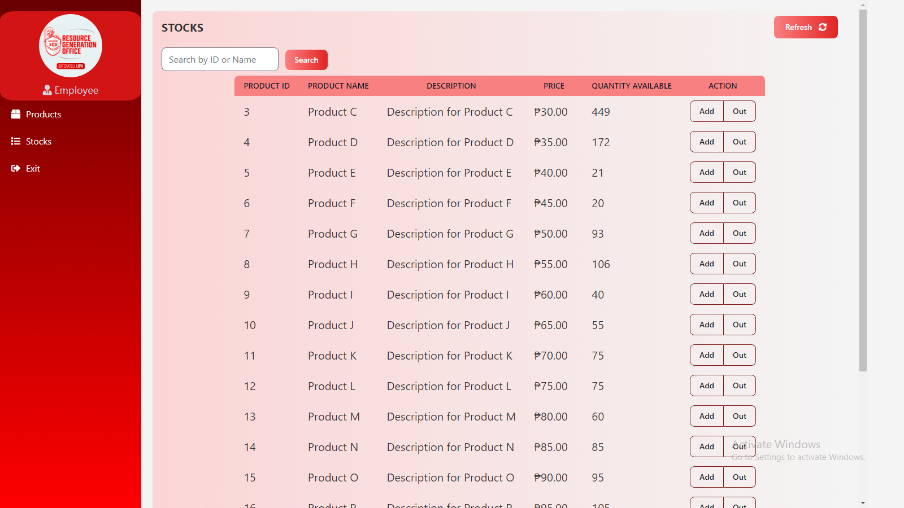
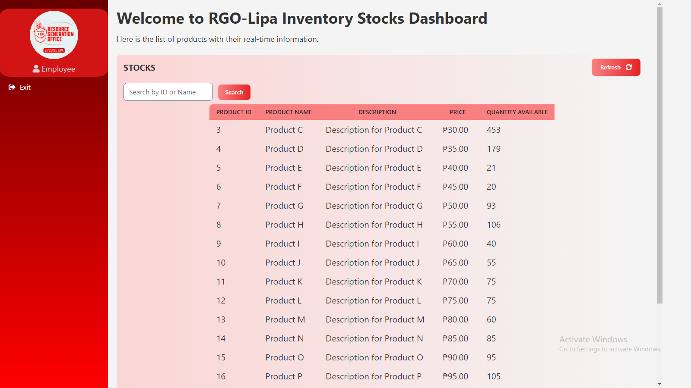

# RGO-Lipa-Inventory-System-with-Stock-Viewing-Dashboard

## Introduction

Welcome to the RGO Lipa Inventory System with Stock Viewing Dashboard project. This system is designed to efficiently manage inventory-related tasks for an organization, providing distinct functionalities for Admins, Employees, and Clients (students). The technologies used in this project include HTML, CSS, JavaScript, PHP, SQL, Tailwind CSS for styling, and AJAX jQuery for dynamic functionality. The database is managed using PHPMyAdmin in XAMPP.

## User Levels

### 1. Admin

#### Dashboard
- Provides a summary of key information related to the inventory system.

#### Products Section
- Allows browsing and management of product information.


#### Transactions Section
- Displays In and Out transactions of stocks for tracking purposes.

#### User Accounts Section
- Provides access to user information, including corresponding employee details.

### 2. Employee

#### Products Section
- Manages product information with add, edit, and delete functions.

#### Stocks Section
- Allows browsing of product information with functionalities for adding and removing stocks.


### 3. Client (Students)

#### Stocks Page
- Enables real-time monitoring of product data, especially stocks.

## Technologies Used

- HTML
- CSS
- JavaScript
- PHP
- SQL
- Tailwind CSS
- AJAX jQuery

## Database Management

- PHPMyAdmin in XAMPP is utilized for efficient database server management.

## Getting Started

1. Clone the repository to your local machine.
   ```bash
   https://github.com/enzouro/RGO-Lipa-Inventory-System-with-Stock-Viewing-Dashboard.git

2. Set up your XAMPP environment with PHPMyAdmin.
- Create a database named `db_ba3102`
- Import the `db_ba3102` database that located inside the [database](database) folder
  
3. Navigate through your xampp folder.
- Find the `xampp` folder inside of your local disc.
- Find the `htdocs` folder, copy and paste the project inside of it.

4. Go to your browser and type [localhost/RGO](http://localhost/RGO/).  *(make sure that the Apache and MySQl is running in your XAMPP server)*

5. Accounts:
- For admin, the username: `admin` , password: `admRGO`
- For emplyee, the username: `employee` , password: `empRGO`
- For client(students/viewers), the username: `client` , password: `RGO`

## Group Members
- John Lorenz Mayo
- Veronica Ann Dulay
- Mary Ann Dela Peña
- Ronalyn Enggay
- Kristine Fabella
